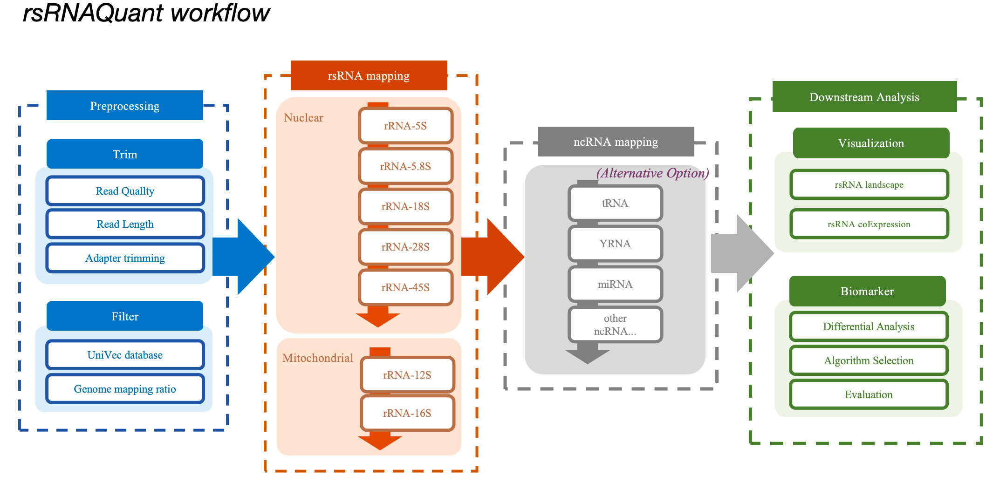
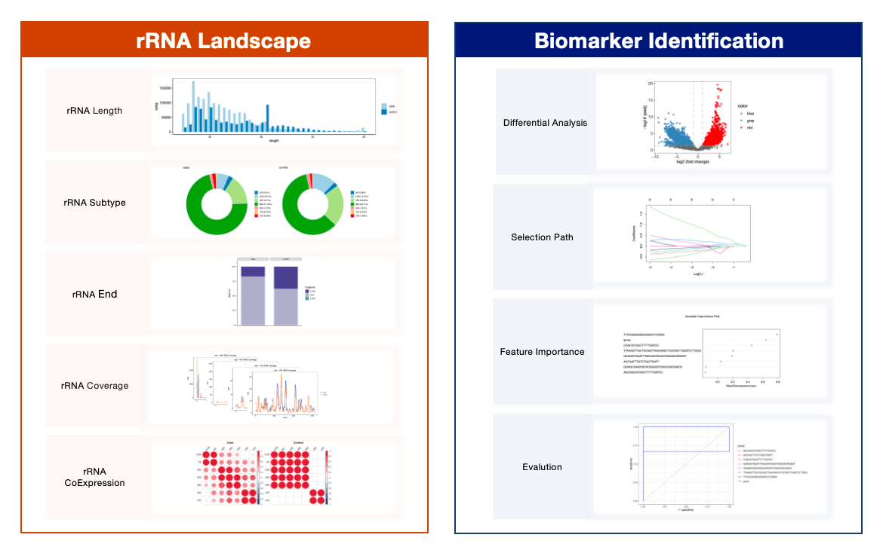
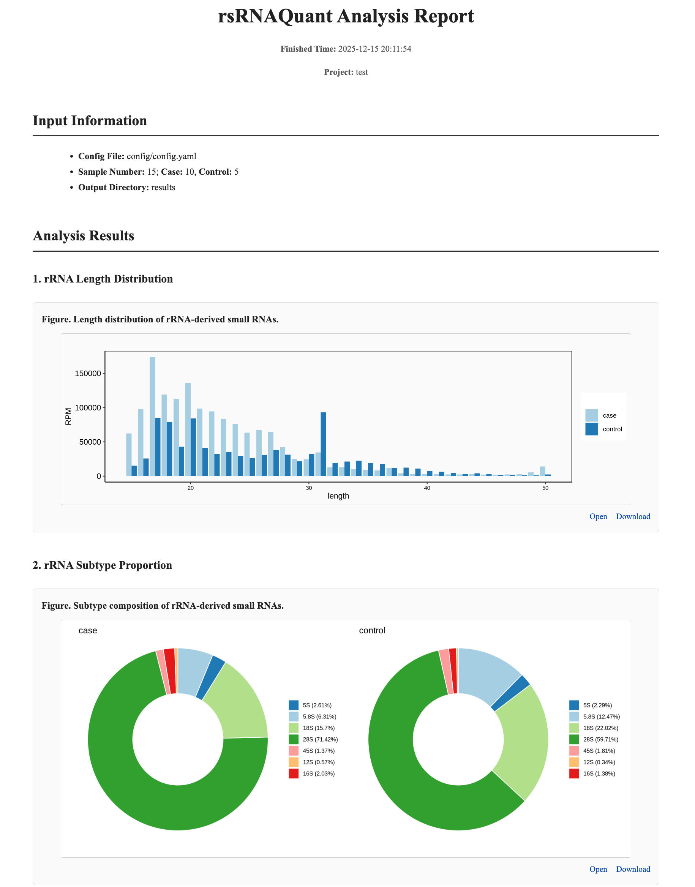

# rsRNAQuant

**rsRNAQuant** is an automated pipeline for quantification and annotation of **rRNA-derived small RNAs (rsRNAs).** It identifies and classifies rsRNAs by providing information on rsRNA length, rsRNA abundance, parental rRNA subtype, parental rRNA end, and other relevant features. It also allows users to optionally perform customized analyses of other small non-coding RNAs (sncRNAs), including tsRNAs, ysRNAs, miRNAs, and additional sncRNA types from small RNA-seq data. 

rsRNAQuant integrates preprocessing, hierarchical mapping, read assignment, normalization, and downstream visualization in a unified framework. It is implemented using **Python, Bash, R**, and **Snakemake**, ensuring reproducibility and scalability across platforms.

---

## 🔬 Overview

rsRNAQuant performs:

* Read preprocessing, including length/quality filtering, adapter trimming, and contaminant removal
* Hierarchical alignment to rRNA references
* Assignment of multi-mapping and multi-overlapping reads
* Transcript-level quantification of rsRNA sequences
* Normalization and summary statistics (RPM, length distribution, etc.)
* Visualization of rsRNA composition and expression patterns
* **Biomarker identification using machine-learning–based approaches**



---


## ⚙️ Installation

### 0️⃣ Requirements
* [[Conda](https://conda.io/)] 
* [[Snakemake](https://snakemake.readthedocs.io/en/stable/)] 

### 1️⃣ Clone the repository
To use rsRNAQuant, you can simply **download the repository** and run the workflow out of the box. Snakemake will automatically handle all required dependencies, provided that it is installed and accessible.
```bash
git clone https://github.com/BIGRICEgo/rsRNAQuant.git
cd rsRNAQuant
```

### 2️⃣ Create the conda environment and install dependencies

We **recommend** using **conda** together with **Mamba** for faster Snakemake installation and more efficient dependency management, preferably within a dedicated environment. The **Miniforge** distribution of conda is a good choice, as it natively supports Mamba. If conda is set up, Snakemake can be installed as follows:

```bash
conda env create -f config/environment.yml
conda activate rsrnaquant
```

If you prefer manual installation, using the command belows will install the necessary packages: 

```bash
conda create -n rsrnaquant python=3.9
conda activate rsrnaquant
pip install snakemake==9.3.3
conda install -c bioconda trim_galore bowtie samtools
conda install -c conda-forge r-base r-ggplot2 r-reshape2 r-dplyr r-tidyr r-optparse r-Hmisc r-corrplot r-jsonlite r-ggforce r-grid r-patchwork r-DESeq2 r-caret r-glmnet r-MASS r-pROC r-randomForest r-ggrepel r-RColorBrewer
pip install pandas numpy 
```

### Download annotation files & test examples

Regarding annotation references, we have pre-built the Bowtie index files. Users can simply download and decompress the package for immediate use.

1. To download annotation references, please use this link: https://yunpan.tongji.edu.cn/link/AAB740E00847784A9DA39F2EAF256F166B

    - To unpack references, please use the code below：
        ```bash
        cd annotation/
        tar -xJvf annotation.tar.xz
        ```

2. To download the test examples, please use this link: 
https://yunpan.tongji.edu.cn/link/AA71605A6F3DA24E24984C48C16704A00D

    - To unpack references, please use the code below：
      ```bash
        cd data/test/
        tar -xJvf test.tar.xz
        ```
    -  The test sample results are included in the rsRNAQuant package. You can find them in the file `Sample_test_results.tar.xz` under `rsRNAQuant/results/`, which can be extracted to view the outputs.


---

## 📂 Directory Structure

```bash
rsRNAQuant/
├── assets/
├── config/
│   ├── config.yaml
│   ├── environment.yml
├── annotation/
│   ├── genome/
│   ├── rRNAdb/
│   ├── UniVec/
│   └── ...
├── data/
│   ├── test/
│   │   ├── case.fastq.gz
│   │   └── control.fastq.gz
├── results/
│   ├── test/
│   │   ├── mapped/
│   │   ├── stats/
│   │   ├── plots/
│   │   └── test_report.html
├── scripts/
│   ├── alignment_summary.sh
│   ├── count_unique_sequences.sh
│   ├── map_rRNA.sh
│   ├── map_ncRNA.sh
│   ├── re_logs.sh
│   ├── process_rna_seq.py
│   ├── CountMatrix.py
│   ├── ExprMatrix.py
│   ├── generate_report
│   ├── RPM.py
│   ├── compare_Plot_rRNA_coverage.R
│   ├── DA.R
│   ├── rRNA_length_distribution.R
│   └── template_report.html
└── Snakefile
```

---


## 🧬 Configuration

Modify parametes inside `config/config.yaml` before running the workflow!!

  - Update your project and sample names, then assign them to the case and control groups.


Example:

```yaml
# config/config.yaml 

# Directories
raw_data_dir: "data" # Path to raw data
results_dir: "results" # Path to output directory
scripts_dir: "scripts" # Path to script directory
annotation_dir: "annotation" # Path to annotation directory
ncRNA: false # Whether to perform analysis of ncRNAs, "true" or "false"
intermediate_files: false # Whether to all mapping details, "true" or "false"

# Project infos
project: "Test" # Project name
samples: # Sample names
  - case1
  - case2
  - case3
  - control1
  - control2
  - control3
groups: # Group to which samples belong.
  case:
    - case1
    - case2
    - case3
  control:
    - control1
    - control2
    - control3
```

---

## ▶️ Running the Pipeline

⚠️ Before running, check that you have downloaded the annotations and already modified the configfile.

### Dry run (check DAG)

```bash
snakemake -n --cores 4
```

### 🧪 Full execution

```bash
snakemake --cores 8 
```

To visualize the workflow:

```bash
snakemake --dag | dot -Tpdf > DAG.pdf
```

### Other condition

To Force rerun:
```bash
snakemake --force
```
To finish uncompleted jobs:
```bash
snakemake --rerun-incomplete
```


---

## 📊 Results

After successful execution, results will be saved under `results/{Project}/`.

| Folder     | Description                                   |
| ---------- | --------------------------------------------- |
| `mapped/`  | Alignment results for genome, rRNA, and ncRNA |
| `stats/`   | Expression matrices and distribution tables   |
| `logs/`    | Execution logs for each Sample                |
| `plots/`   | Plots and biomarker results                   |

Main outputs include:

* `*_alignment_summary_rRNA.txt`: Hierarchical rRNA assignment details
* `*_expression_matrix.txt`: Normalized sncRNA expression table
* `*_rRNA_length_distribution.txt`: Length distribution per rRNA category
* `*_DA_result.txt`: Differential analysis results
* `*_lasso_selected_features.txt`: LASSO-selected features table
* PDF/PNG visualizations: distribution barplots, category pie charts, coverage lineplots, co-expression heatmaps, feature importance dotplots, ROC curves, etc.




### Result report
The result report is generated in the `Results/` directory, and the report is a HTML file which can be opened in any Web browser.



---

## 🧭 FAQs

**Q1.** `MissingInputException: Missing input files for rule trim_reads` 

→ Ensure raw FASTQ files are correctly placed in `data/` and match the sample names in `config.yaml`.

**Q2.** How to regenerate the DAG after edits?

```bash
snakemake --dag | dot -Tpdf > DAG.pdf
```

**Q3.** How to clean intermediate files?

Add `temp()` to intermediate outputs in the Snakefile or run:

```bash
snakemake --delete-temp-output
```

---

## ⛵️ Advanced Usage

The Snakemake framework provides flexible rule definition and workflow control, allowing users to customize rules according to specific needs. For example:

1. **Optional Alignment to Other ncRNA Types**

    Users can enable analysis of additional small non-coding RNAs by setting the ncRNA parameter to true in the `config/config.yaml` file (default: false, which restricts analysis to rsRNAs only). 

2. **Retention of Intermediate Files**

    To retain intermediate alignment files (stored in `results/mapped/`), set intermediate_files to true in config/config.yaml. Users should ensure sufficient disk space is available when enabling this option.


---

## 📚︎ More Infos

👉 See more usage details and **full-size report.html** in [[**Guidelines**](http://rsrnadisease.zhanglab-bioinfo.cn/Tool)] for rsRNAQuant. 

🚩 More informations could be found in related database: [[**rsRNADisease**](http://rsrnadisease.zhanglab-bioinfo.cn/)].


---

## 👩‍🔬 Authors

**Huang RF**, PhD Candidate [Zhanglab / Tongji Uni]

If you have any questions, bug reports, or suggestions, please contact:

  **Prof. Xiao-Ou Zhang**  

- See our recent work: [https://xozhanglab.com/]

- Contact: [📧 zhangxiaoou@tongji.edu.cn](zhangxiaoou@tongji.edu.cn)

---


## 🧾 Citation

If you use rsRNAQuant in your work, please cite:

> **Huang RF**, **Zhang XO**.
> **rsRNAQuant: a reproducible pipeline for comprehensive quantification of extracellular vesicle small RNAs**.
> (Manuscript in preparation)
